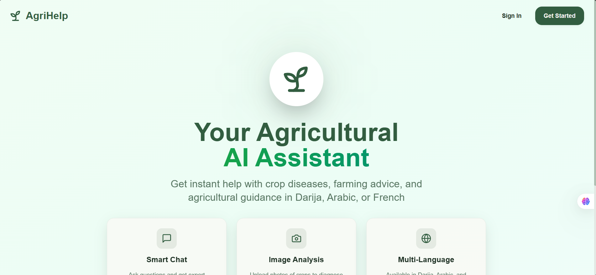

# AgriHelp - Agricultural AI Assistant
---

An intelligent agricultural assistant application that helps farmers diagnose crop diseases, get farming advice, and receive treatment recommendations in multiple languages (Darija, Arabic, French).

## 🌟 Features

### ✅ Implemented
- **Mobile-First Design** - Optimized for mobile devices with touch-friendly interfaces
- **Multi-Language Support** - Darija, Arabic, and French
- **Authentication System** - Sign up, sign in, and user management
- **Modern UI** - Built with shadcn/ui and Tailwind CSS
- **Responsive Design** - Works seamlessly on mobile, tablet, and desktop

### 🚧 Ready for Backend Integration
- **LLM Chat Integration** - Agricultural AI assistant for farming advice
- **Image Analysis** - Crop disease detection and diagnosis
- **Treatment Recommendations** - Automated treatment suggestions
- **Conversation History** - Persistent chat sessions

## 📁 Project Structure

```
agrihelp-app/
├── src/
│   ├── api/                    # API configuration
│   │   ├── config.ts          # Centralized API endpoints
│   │   └── README.md          # API integration guide
│   │
│   ├── services/              # Backend service integrations
│   │   ├── llmService.ts      # LLM API integration
│   │   ├── imageAnalysisService.ts  # Image analysis API
│   │   ├── index.ts           # Service exports
│   │   └── README.md          # Services documentation
│   │
│   ├── pages/
│   │   ├── auth/              # Authentication pages
│   │   │   ├── Landing.tsx    # Homepage
│   │   │   ├── SignIn.tsx     # Sign in page
│   │   │   └── SignUp.tsx     # Sign up page
│   │   ├── Index.tsx          # Chat interface
│   │   └── NotFound.tsx       # 404 page
│   │
│   ├── components/            # Reusable UI components
│   │   ├── chat/             # Chat-specific components
│   │   └── ui/               # shadcn/ui components
│   │
│   ├── hooks/                # Custom React hooks
│   ├── integrations/         # Third-party integrations (Supabase)
│   ├── lib/                  # Utility functions
│   └── types/                # TypeScript type definitions
│
├── public/                   # Static assets
└── supabase/                # Supabase configuration
```

## 🚀 Getting Started

### Prerequisites

- Node.js 18+ and npm
- Git

### Installation

1. **Clone the repository**
   ```bash
   git clone <YOUR_GIT_URL>
   cd agrihelp-app
   ```

2. **Install dependencies**
   ```bash
   npm install
   ```

3. **Set up environment variables**
   
   Create a `.env` file in the project root:
   ```env
   # Backend API URL (update when backend is ready)
   VITE_API_BASE_URL=http://localhost:3000
   
   # Supabase (if using)
   VITE_SUPABASE_URL=your_supabase_url
   VITE_SUPABASE_ANON_KEY=your_supabase_key
   ```

4. **Start the development server**
   ```bash
   npm run dev
   ```

   The app will be available at `http://localhost:5173`

## 🛠️ Tech Stack

- **Frontend Framework**: React 18 with TypeScript
- **Build Tool**: Vite
- **UI Components**: shadcn/ui
- **Styling**: Tailwind CSS
- **Routing**: React Router v6
- **State Management**: React Query (TanStack Query)
- **Form Handling**: React Hook Form + Zod
- **Icons**: Lucide React
- **Backend Ready**: Supabase integration

## 📱 Pages & Routes

| Route | Page | Description |
|-------|------|-------------|
| `/` | Landing | Homepage with features and CTA |
| `/signin` | Sign In | User authentication |
| `/signup` | Sign Up | User registration |
| `/chat` | Chat Interface | AI assistant chat |

## 🔧 Backend Integration

The app is structured to easily integrate with a backend API for LLM and image analysis.

### Required Backend Endpoints

#### LLM Endpoints
- `POST /api/llm/chat` - Send message to AI
- `POST /api/llm/stream` - Stream AI responses

#### Image Analysis Endpoints
- `POST /api/image/upload` - Upload image
- `POST /api/image/analyze` - Analyze image for diseases
- `POST /api/image/analyze-base64` - Analyze base64 image

#### Authentication Endpoints
- `POST /api/auth/signin` - User sign in
- `POST /api/auth/signup` - User registration
- `POST /api/auth/signout` - User sign out
- `POST /api/auth/refresh` - Refresh auth token

### Service Usage Examples

**LLM Service:**
```typescript
import { sendMessageToLLM } from '@/services';

const response = await sendMessageToLLM({
  message: 'What is wrong with my tomato plant?',
  language: 'darija',
  imageUrl: 'https://...',
});
```

**Image Analysis Service:**
```typescript
import { uploadAndAnalyzeImage } from '@/services';

const analysis = await uploadAndAnalyzeImage(file, 'arabic');
console.log(analysis.detections); // Disease detections
console.log(analysis.treatment);  // Treatment recommendations
```

For detailed backend integration instructions, see:
- [`src/services/README.md`](src/services/README.md)
- [`src/api/README.md`](src/api/README.md)

## 🎨 Design System

The app uses a custom agricultural theme with:
- **Primary Color**: Deep Olive Green (`hsl(140 30% 28%)`)
- **Accent Color**: Wheat Gold (`hsl(42 85% 55%)`)
- **Background**: Gradient from green-50 to teal-50
- **Typography**: Nunito (Latin), IBM Plex Sans Arabic (Arabic)

### Mobile-First Approach
- Touch targets: Minimum 44x44px
- Responsive typography: `text-base sm:text-lg`
- Adaptive spacing: `p-6 sm:p-8`
- Full-width CTAs on mobile

## 📦 Available Scripts

```bash
# Development
npm run dev          # Start dev server

# Build
npm run build        # Production build
npm run build:dev    # Development build

# Linting
npm run lint         # Run ESLint

# Preview
npm run preview      # Preview production build
```

## 🌍 Multi-Language Support

The app supports three languages:
- **Darija** (Moroccan Arabic)
- **Arabic** (Modern Standard Arabic)
- **French**

Language selection is available in the chat interface and affects:
- UI text direction (RTL for Arabic languages)
- AI responses
- Disease diagnosis
- Treatment recommendations

## 🔐 Authentication

Currently using simulated authentication. To integrate with real authentication:

1. **Update Sign In/Sign Up pages** to use Supabase or your backend
2. **Create Auth Context** for managing user state
3. **Add Protected Routes** to restrict access to authenticated users
4. **Implement Token Management** for API requests

## 📝 Development Guidelines

### Code Style
- Use TypeScript for type safety
- Follow React best practices
- Use functional components with hooks
- Implement proper error handling

### Component Structure
- Keep components small and focused
- Use composition over inheritance
- Extract reusable logic into custom hooks
- Maintain consistent naming conventions

### Mobile-First CSS
```tsx
// Always write mobile styles first, then scale up
className="text-base sm:text-lg md:text-xl"
//          ↑ mobile   ↑ tablet   ↑ desktop
```

## 🚀 Deployment

### Build for Production
```bash
npm run build
```

The build output will be in the `dist/` directory.

### Deploy to Vercel/Netlify
1. Connect your Git repository
2. Set environment variables
3. Deploy automatically on push

## 🤝 Contributing

1. Fork the repository
2. Create a feature branch (`git checkout -b feature/amazing-feature`)
3. Commit your changes (`git commit -m 'Add amazing feature'`)
4. Push to the branch (`git push origin feature/amazing-feature`)
5. Open a Pull Request

## 📄 License

This project is licensed under the MIT License.

## 🆘 Support

For issues and questions:
- Check the documentation in `src/services/README.md` and `src/api/README.md`
- Open an issue on GitHub
- Contact the development team

## 🎯 Roadmap

- [ ] Implement real authentication with Supabase
- [ ] Connect to LLM API (OpenAI/Gemini)
- [ ] Integrate image analysis API
- [ ] Add conversation history persistence
- [ ] Implement offline support
- [ ] Add PWA features
- [ ] Create admin dashboard
- [ ] Add analytics and monitoring

---

Built with ❤️ for farmers everywhere
